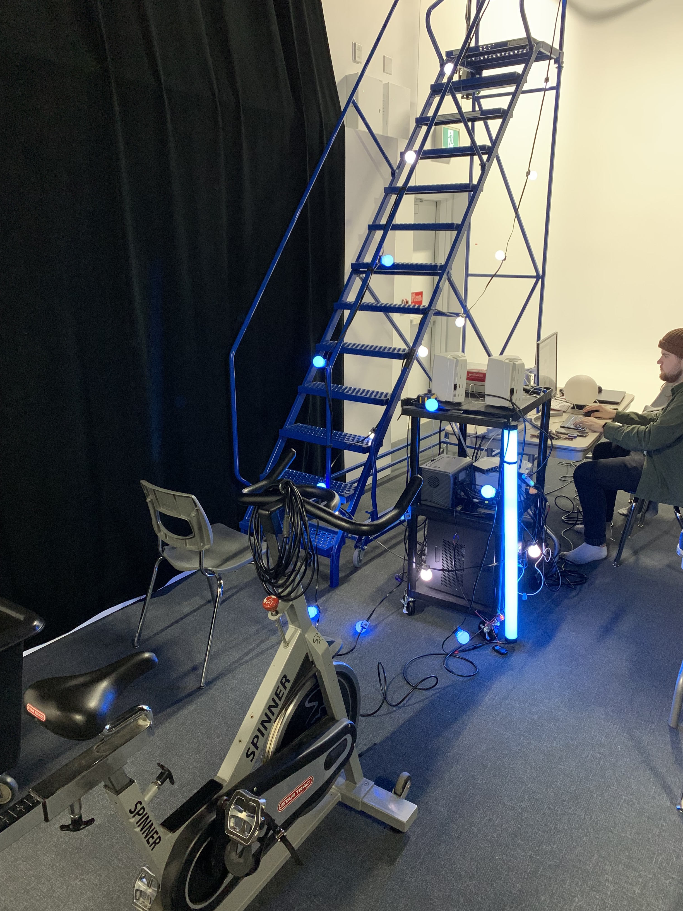
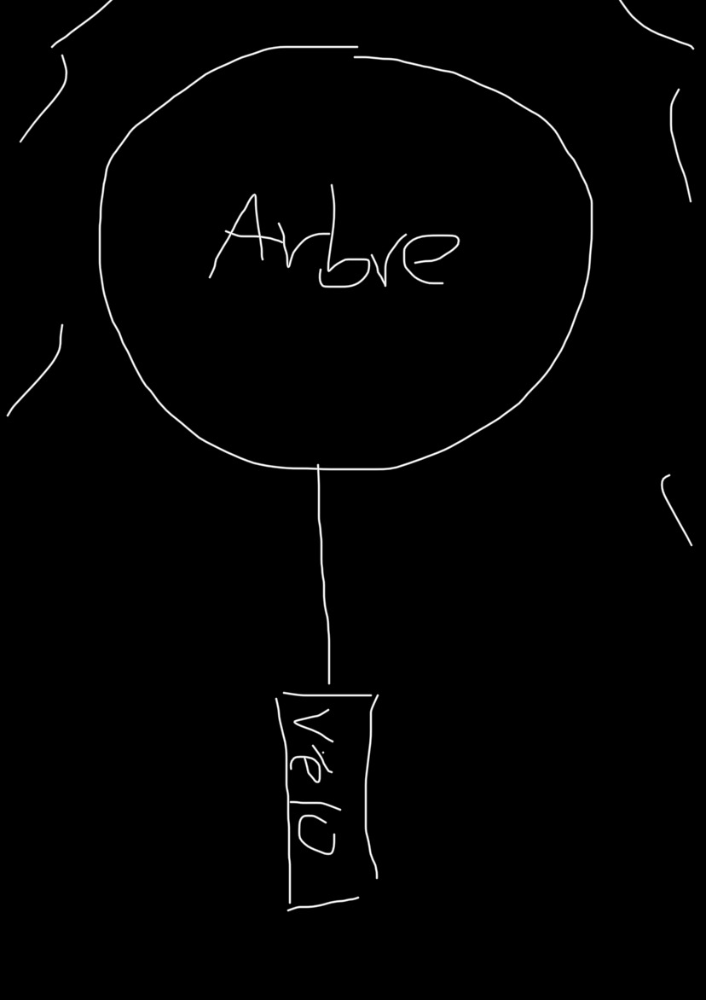
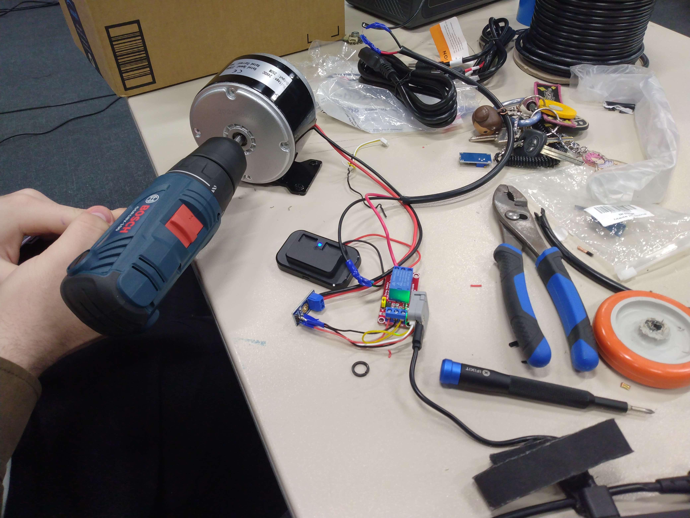

# **Luma Sol**

## Exposition
Mycélium

## Lieu de mise en exposition
Collège Montmorency

## Type d'exposition
Temporaire

## Date de votre visite
16 février 2023

## Titre de l'oeuvre
Luma Sol

## Nom des artistes
Éloïse Gagné, Skayla Stimphil, Michaël Simard et Pénélope Morrisson.

## Année de réalisation
2023

## Description de l'oeuvre ou du dispositif

Il s'agit d'une expérience multimédia où vous pouvez interagir avec la lumière et un rythme musicale à partir d'un vélo stationnaire. Quand quelqu'un monte sur le vélo et pédale, cela illumine les Dels qui entourent l'arbre et celles qui seront suspendues aux bouts de certaines branches sous la forme de feuilles. D'autres DEl en forment de fleurs seront sur les plantes environnantes . Toutes ces DEL adressables s'éclairent selon le rythme de l'utilisateur et s'arrêtent automatiquement dès qu'il arrête de pédalé . Les couleurs sont prédéfinis en avance et chaque changement de lumières représente une saison. Cela représente le cycle des saisons.

## Type d'installation
interactive

## Mise en espace

L'oeuvre a été mise ne place dehors. Le vélo fait face a un arbre et est relié a celui-ci. Le dispositif lumineux est accrocher dans l'arbre en question et six poteaux lumineux entour le vélo.

## Composantes et techniques

- Logiciels ( Arduino, Visual studio code, VCV et Madmapper )
- ordinateurs ( 1 mac mini )
- équipement manuel ( perceuse, toune-vis, ect... )
- pieces électroniques

## Éléments nécessaires à la mise en exposition
- cables
- cache-fils
- LED Strip DMX
- DMX Dot String
- Boules lumineuses 200mm
- Boule lumineuses 36"
- Tubes opal 1m, 1,5m, 2m
- 2 multiprises
- 2 ac current sensor
- 2 moteurs
- 2 microControleurs
- 2 détecteurs de rotation des pédales
- 2 microControleurs
- 2 Haut-parleurs
- 2 Caisson étanche
- Magrétomètre
- vélo-stationnaire

## Expérience vécue
Je suis très impressionné par les projets que les étudiants ont réalisés. Luma Sol m'a beacoup surpris, je ne savais pas qu'un projet pouvait comporter autant de particularitées et de facettes. C'est quand meme incroyable que des étudiants ai réussi à faire de la lumière et des sons à partir d'un vélo-stationnaire. Dans une seule oeuvre, tu peux découvrir plusieurs saisons, écouter toute sorte de sons et voir un magnifique jeux de lumières tout en pédalant! 

## ❤️ Ce qui vous a plu
Ce qui m'a le plus plu: Les mangnifiques lumieres déposer sur l'arbre, le fait fait de pouvoir bouger ( pédaler ) pendant l'expérience, le fait que le projet soit situé a l'extérieure, le fait de pouvoir faire de l'énergie sans polué ( mécanique et électrique ) car cela nous sensibilise au niveaux de l'environnement et les différents sons qu'on peut entendre.

## 🤔 Aspect que vous ne souhaiteriez pas retenir pour vos propres créations ou que vous feriez autrement
Ce qui m'a le moins plu: Je pense que la sensibilisation via l'environnement n'est pas assez claire. Oui, on pédale pour faire de l'électricité mais selon moi, ils devrait montrer artistiquement ce que le changement climatique ou ce que les problèmes d'environnement font sur la société. Finalement, j'aurais aimé que les jeux de lumières dans l'arbre soient plus élaborés. Anisi, ils auraient pu mettre plus de personnalité dans le projet.

## Références
https://tim-montmorency.com/2023/projets/LumaSol/docs/web/index.html
