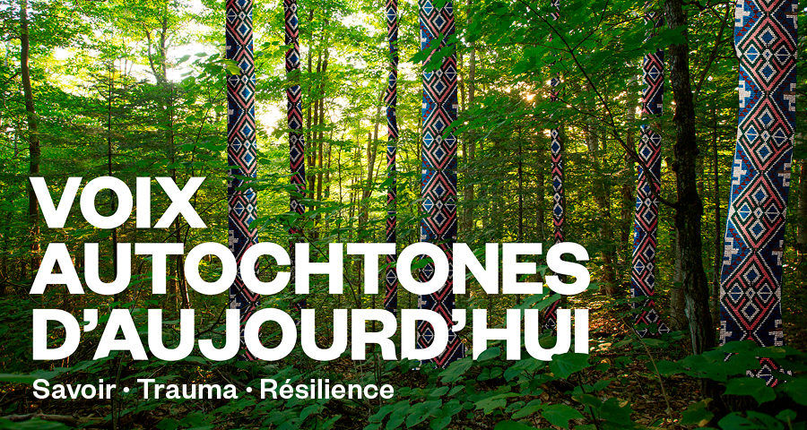
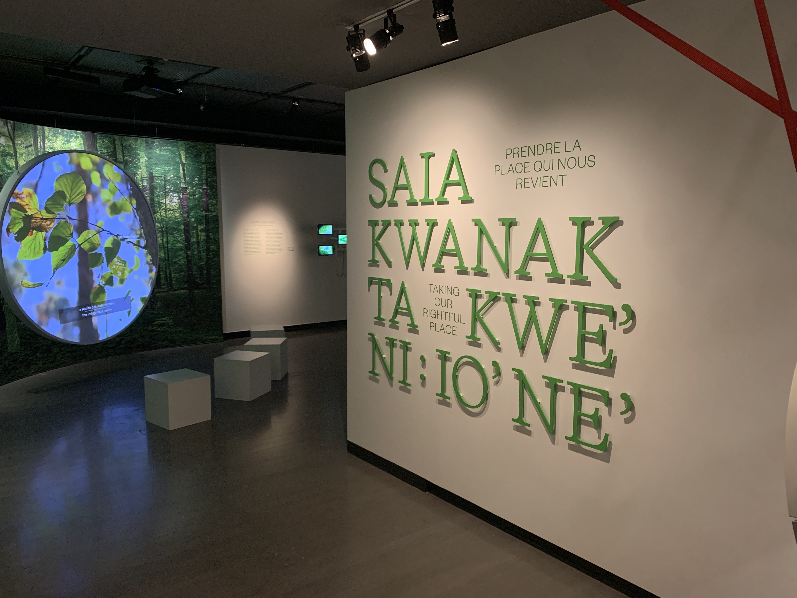
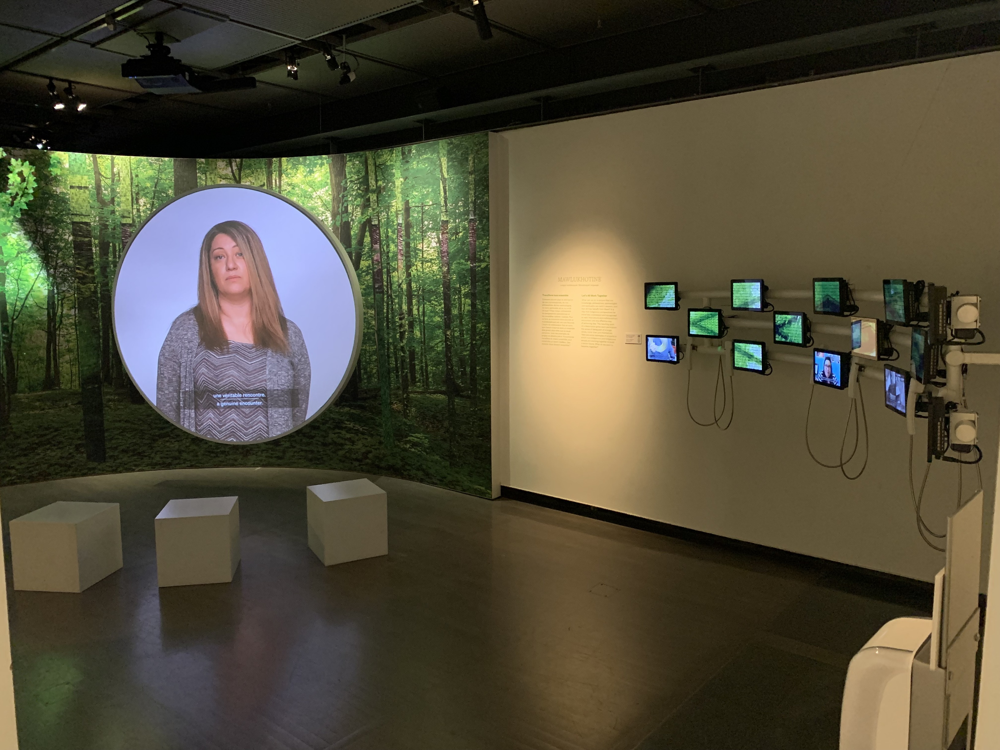
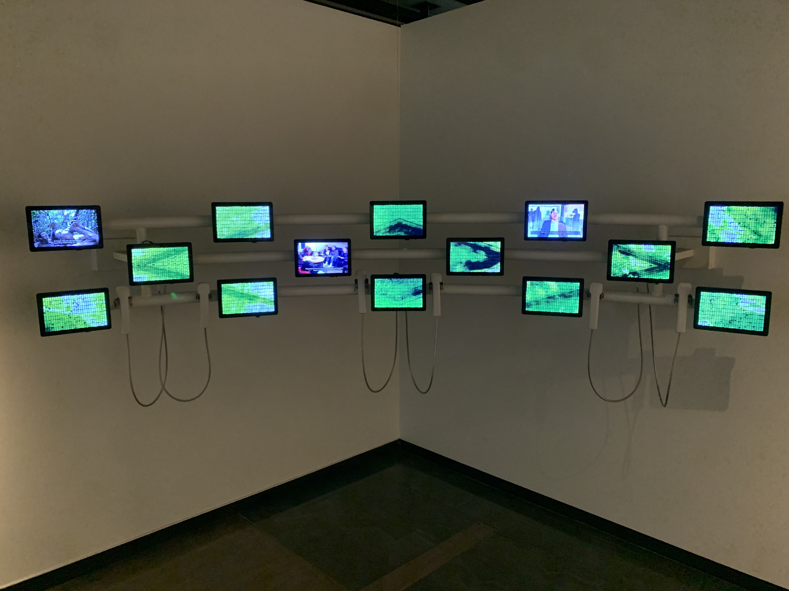
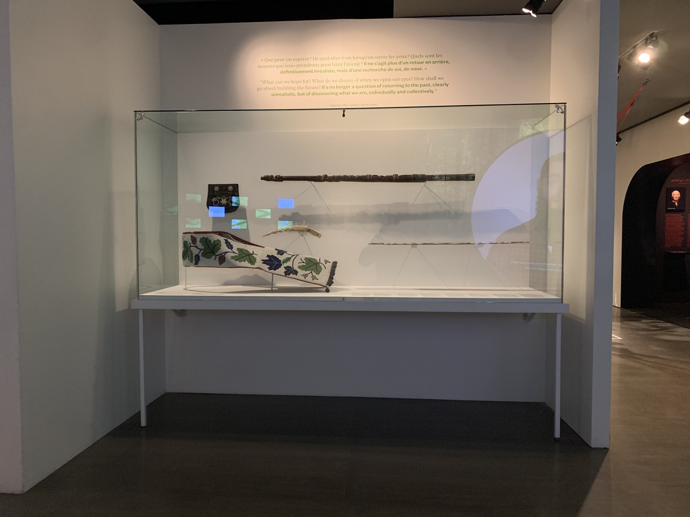
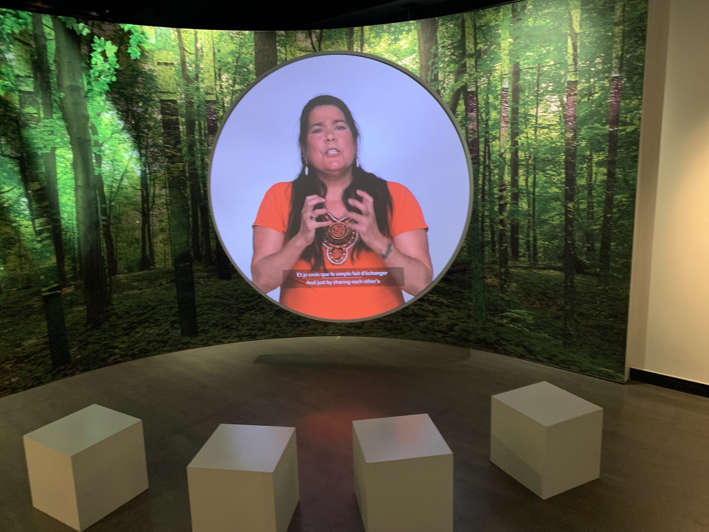
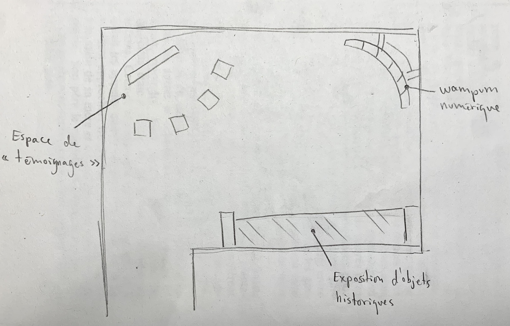
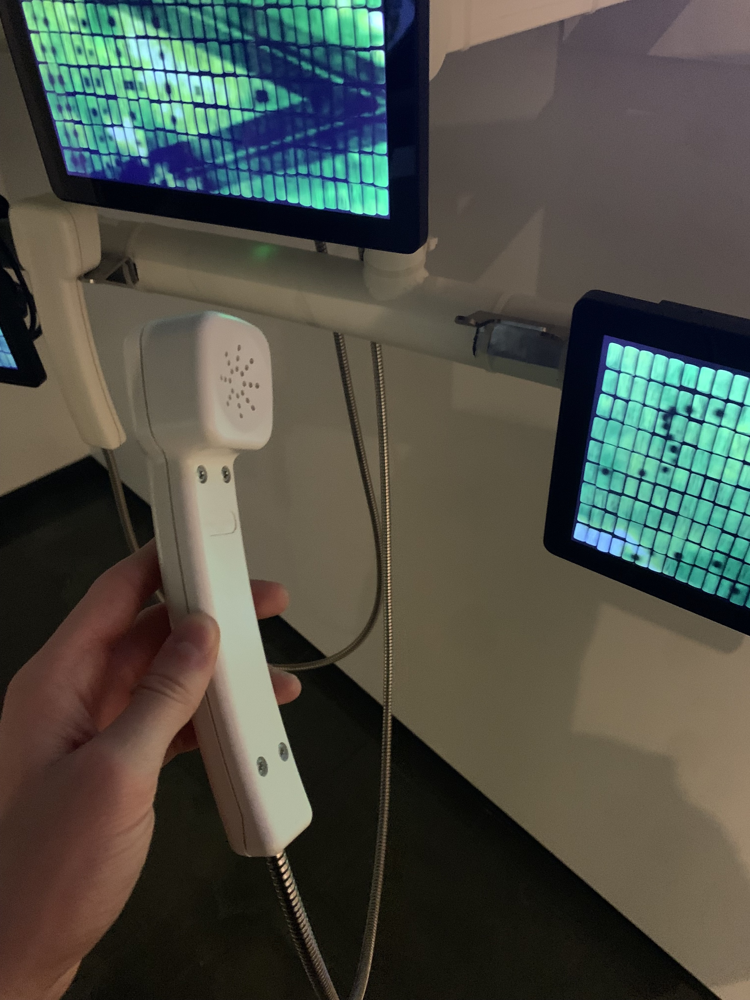
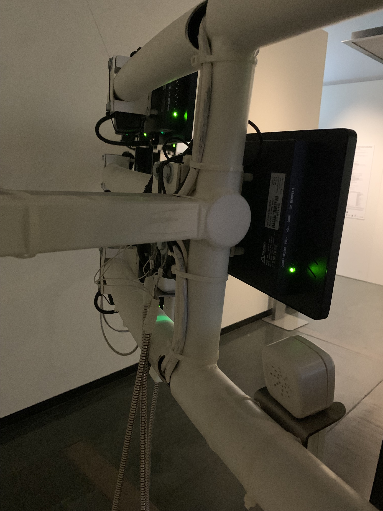
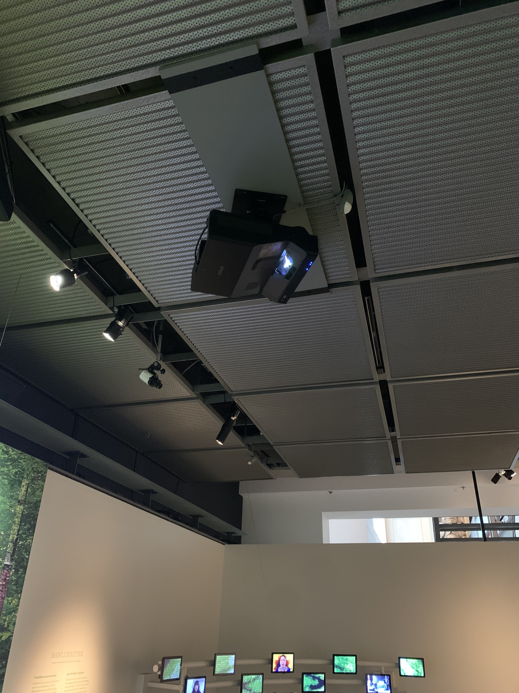

# **Ma visite individuelle**

## Exposition
Voix autochtones d'aujourd'hui - Savoir, trauma, résilience

## Lieu de mise en exposition
Musée McCord Stewart

## Type d'exposition
Permanente et intérieure

## Date de votre visite
Mardi, 11 Avil 2023

## Titre de l'oeuvre ou du dispositif
SAIAKWANAKTAKWE'NÍ:IO'NE' ( Prendre la place qui nous revient )

## Nom de l'artiste ou de la firme
Par Elisabeth Kaine et l’Innu Jean St-Onge.

## Année de réalisation
2021

## Description de l'oeuvre ou du dispositif
L’exposition Voix autochtones d’aujourd’hui : savoir, trauma, résilience témoigne des savoirs encore trop méconnus des peuples autochtones, des blessures profondes qu’ils portent et de leur incroyable résilience.

## Type d'installation
Contemplative et immersive

https://www.youtube.com/shorts/7mT_0Em8TFE

https://www.youtube.com/watch?v=6tDy9oVOZag

## Fonction du dispositif multimédia
Comme je l'ai mentionné plus haut, ce dispositif témoigne des savoirs encore trop méconnus des peuples autochtones, des blessures profondes qu’ils portent et de leur incroyable résilience face à la situation.

https://www.youtube.com/shorts/FKmnDt6P8UU

## Mise en espace
Lorsqu'on entre dans la pièce, en tout premier, on a l'espace où sont diffusés les témoignages. Cette espace contient un projecteur qui diffuse des vidéos sur un grand dispositif circulaire. Tout cet espace est entouré de murs qui, eux aussi, projettent des vidéos d'une forêt pour nous mettre dans l'ambiance et devant le dispositif circulaire, 4 bancs lui font face pour permettre aux visiteurs de s'assoir. Ensuite, nous avons le wampum numérique. Celui-ci fait face à l'espace de témoignage et est soutenu par deux murs de la pièce. Finalement, sur le dernier mur, se tient un présentoir où on présente des objets historiques relier à l'exposition.

## Composantes et techniques
- Logiciels
- ordinateur

## Éléments nécessaires à la mise en exposition
- projecteur
- bancs
- toile
- Plâtre
- vitres
- pièces en metal ( vises, clous, ect... )
- écrans
- téléphones

## Expérience vécue
J'ai aimé visiter cette exposition. Dès que je suis rentré dans la pièce, la petite diffusion d'une forêt sur le mur m'a tout de suite mis dans le thème, je pouvais me mettre à la place des autochtones. L'exposition dégageait une ambiance relaxante, mais aussi pesante pour nous rappeler toutes les choses que les autochtones ont subies. En rentrant, tu distingues tout d'abord une petite forêt calme dans le nord du Québec mais après, les vidéos et les discours touchants apport a cette forêt et cet environnement une ambiance triste et touchante. Le wampum numérique ma beaucoup plus, le fait que les vidéos du wampum soient diffusées aléatoirement m'a amusé. Finalement, les visuels et les illustrations étaient magnifiques.

## ❤️ Ce qui vous a plu
Ce qui m'a le plus plu: Les diffusions sur les murs, car les animations étaient fluides et le design graphique suivait bien le thème de l'exposition. Les téléphones qui nous permettaient d'écouter les vidéos, car je trouve l'idée originale. La partie de l'exposition où étaient exposés des objets historiques, car cela m’a mis encore plus dans l'ambiance, m'a  permis d'apprendre des choses et j'ai pu voir à quoi ressemble un vrai wampum. La façon dont était exposé le wampum numérique, car cela a apporté un côté plus dynamique.

## 🤔 Aspect que vous ne souhaiteriez pas retenir pour vos propres créations ou que vous feriez autrement
Ce qui m'a le moins plus plu: je trouve que le wampum numérique aurait pu comporter moins de vidéos, écouter toutes les vidéos m'a pris beaucoup de temps. Aussi a leur place, j'aurais indiqué combien de vidéos comportent l'exposition, car on ne sait jamais que le tout va finir. Finalement, l'idée des téléphones est très originale, mais si beaucoup de personnes sont présentes une journée, l'attente pourrait être très longue vu que l'exposition ne comporte que 6 téléphones...

## Références
https://www.musee-mccord-stewart.ca/fr/expositions/voix-autochtones-aujourdhui/
